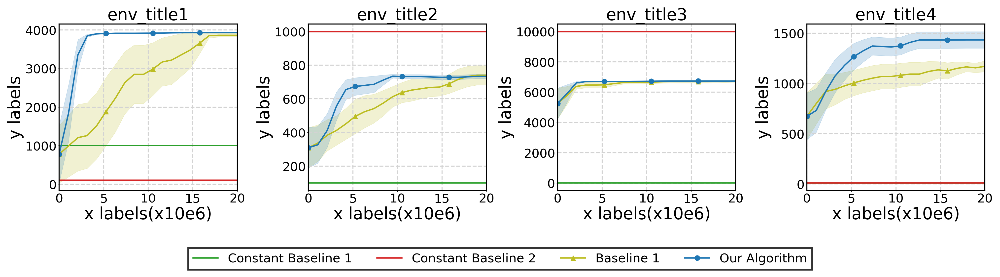

## README: Plotting Algorithm Performance Across Environments


### Input Data Format
- CSV filenames must follow the naming convention:  
  ```
  {algo}_{env}.csv
  ```
  where:
{algo} is one of the algorithm names (e.g., OPE, Val, Baseline_Random_Selection, BOMS_BOMS), including different ablations such as varying learning rates (lr) (e.g., lr_01, lr_1, lr_10).  - `{env}` is the environment name (e.g., `walker2d-medium`, `hopper-medium`, etc.).

- Each CSV file must contain a **2D numerical array** of shape:
  ```
  [n_seed, n_length]
  ```
  where:
  - `n_seed` represents the number of different experiment runs (seeds).
  - `n_length` represents the number of evaluation steps per experiment.

---

### Recommended Data Preparation
Before running the script, it is **highly recommended** to pre-process the data into this structured format. This ensures:
1. **Consistency** across different algorithms and environments.
2. **Ease of visualization** without additional modifications.
3. **Better handling of variability** (the script computes the mean and standard deviation across seeds automatically).

---

### Dependencies
Ensure you have the following Python packages installed:
```bash
pip install numpy pandas matplotlib scipy
```

---

### How to Run
1. **Place your CSV files** inside the `raw_data` directory.
2. **Execute the script**:
3. The output figures will be saved as:
   ```
   sample_multi_figure.png
   sample_multi_figure_legend.png
   sample_multi_figure_with_legend.png
   sample_one_figure.png
   ```

---

### Description of Output Figures

- **sample_multi_figure.png**: A multi-panel figure where each subplot represents a different environment.
- **sample_multi_figure_legend.png**: The legend is separately plotted for the multi-panel figure.
  
  
 The legend is not included in this figure.
- **sample_multi_figure_with_legend.png**: A multi-panel figure where the legend is placed below all subplots.
  
- **sample_one_figure.png**: A single-panel figure where the legend is placed within the plot.
  

---

### Customization
- **Appearance Settings**
  - Colors, markers, and line styles are defined in the script.
  - Modify the following variables for different visualization preferences:
      - markersize = 15: Sets the size of the markers in the plot.
      - markevery = 5: Defines the interval at which markers appear along the line.
      - linewidth = 4: Specifies the thickness of the plotted lines.
      - leg_font_size = 12: Adjusts the font size of the legend text.
- **Environment & Algorithm Mapping**
  - The script uses predefined mappings (`env_limits`, `env_tiles`, `env_optima`).
    - env_limits represents the length of the data.
    - env_optima represents the constant line data used for reference.
  - To add new environments or algorithms, update these dictionaries.
    
---
* Note: The plotting order of multiple figures follows the sequence defined in env_limits.


